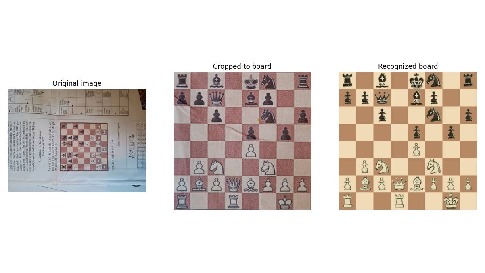
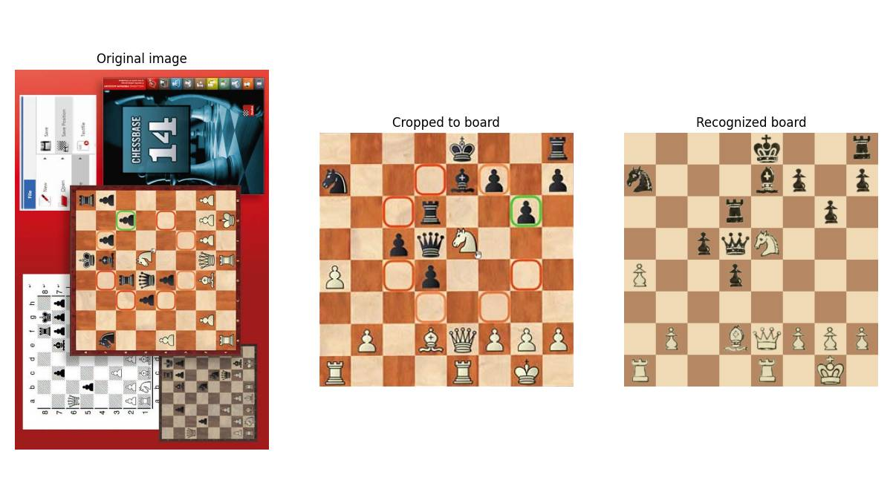
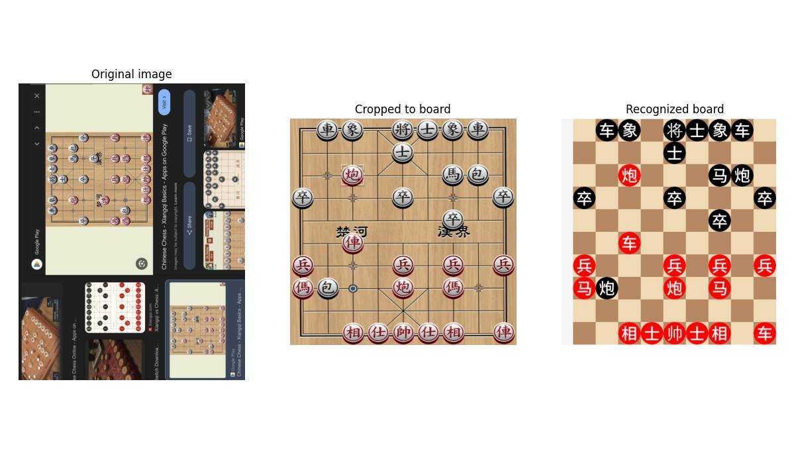
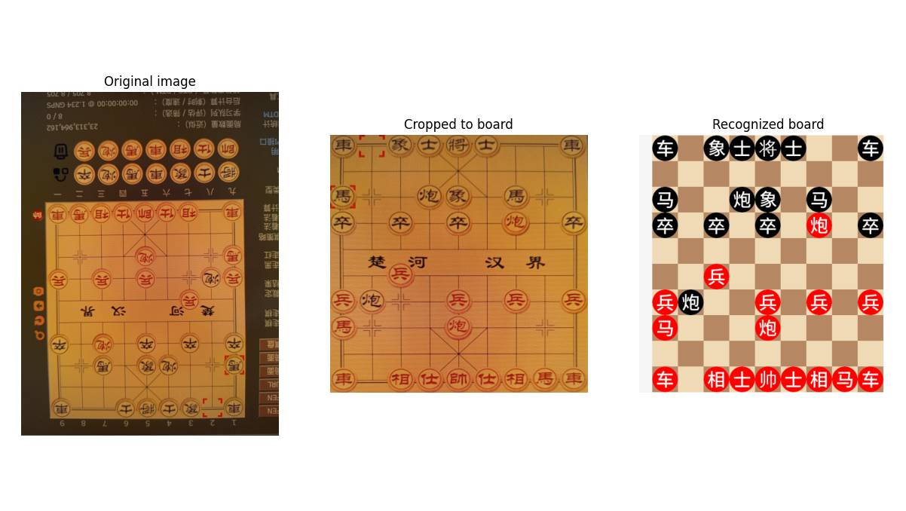
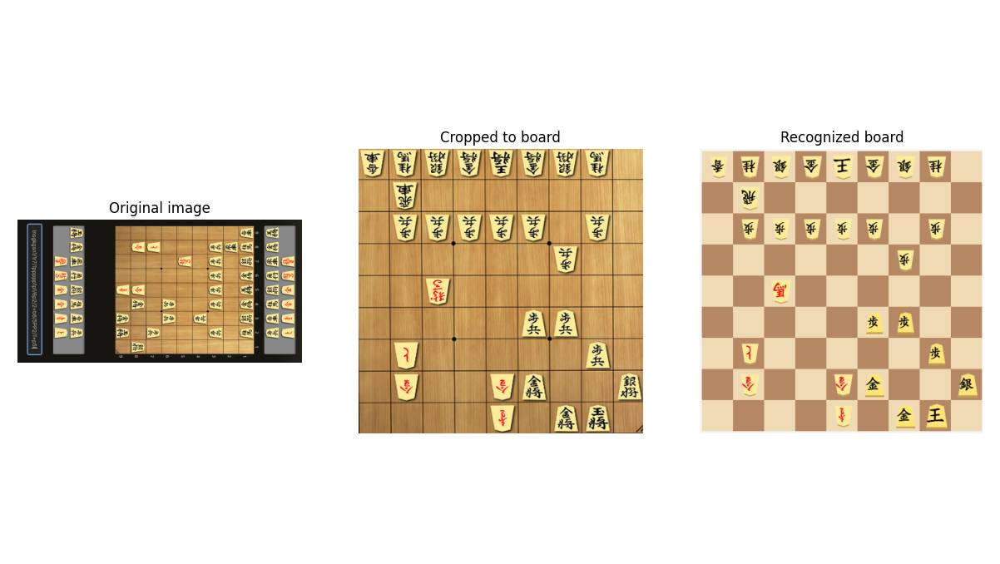
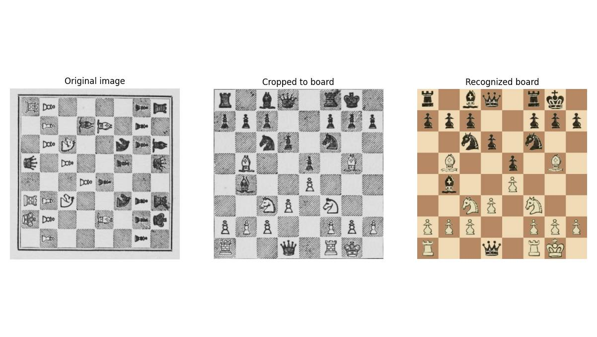
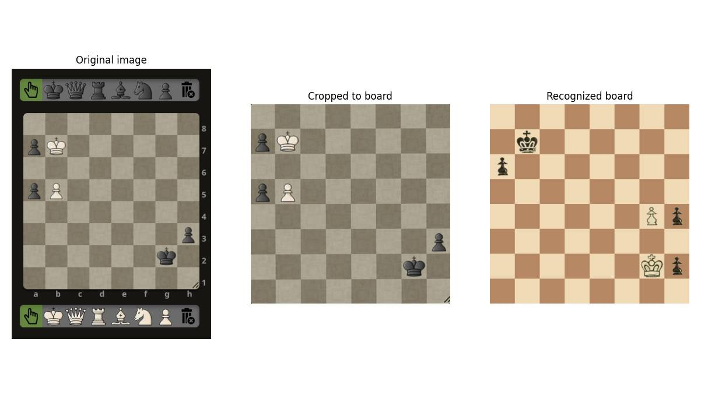
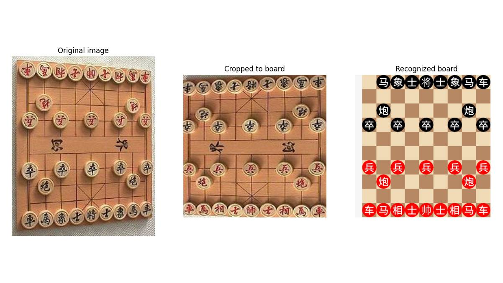
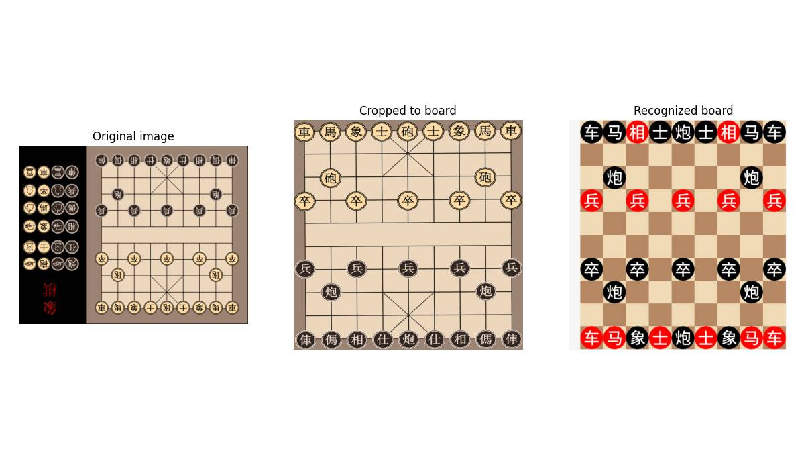
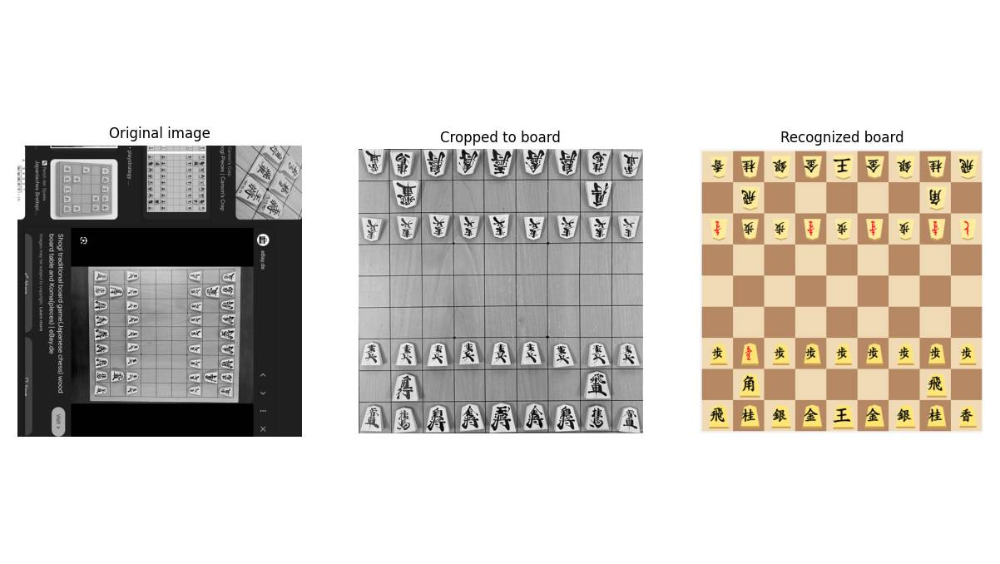

# Chess diagram to FEN

Extract the FEN out of images of chess, xiangqi, or shogi diagrams.

It works in multiple steps:
1. Detect if there exists any chess board in the image
2. Get a bounding box of the (most prominent) chess board
3. Check if the board image is rotated by 0, 90, 180, or 270 degrees
4. Finally detect the FEN by looking at each square tile and predicting the piece
5. Detect if the perspective is from blacks or whites perspective (using a simple fully connected NN)

All these steps (except the 5th) basically use some common pretrained convolutional models available via torchvision with slightly modified heads. Detection is made robust using demanding generated training data and augmentations.

Chess works best, xiangqi works fine too, shogi doesn't work very well (and this program also doesn't handle pieces in hand).
It should be quite possible to add support for other games, at least for ones that are supported by [pychess-variants](https://github.com/gbtami/pychess-variants) (which is needed for PGN support which you'd need to train the orientation model (see step 5 above)).

## Install

Install [uv](https://docs.astral.sh/uv/getting-started/installation/) and then clone the project:

```shell
git clone "https://github.com/tsoj/Chess_diagram_to_FEN.git"
cd Chess_diagram_to_FEN
```

Then install dependencies with the PyTorch variant that matches your hardware:

```shell
uv sync --extra cpu     # CPU (works everywhere, no GPU required)
uv sync --extra cuda    # CUDA 12.8  (NVIDIA GPUs)
uv sync --extra rocm    # ROCm 6.4   (AMD GPUs, Linux only)
```

You can use download already trained models like this, if you don't want to train them yourself:

```shell
./download_models.sh
```

If you want to use this repository as a dependency inside another Python project, install it as editable:

```shell
# from the consuming project (you might need to adjust the path to Chess_diagram_to_FEN)
uv add --editable ../Chess_diagram_to_FEN
```

## Usage

```python
from PIL import Image
from chess_diagram_to_fen import get_fen

img = Image.open("your_image.jpg")
result = get_fen(
    img=img,
    game="chess",
    auto_rotate_image=True,
    auto_rotate_board=True
)

print(result.fen)
```

Or use the demo program:
```shell
uv run python chess_diagram_to_fen.py --game chess --dir resources/test_images/real_use_cases_chess/
```


## Train models yourself

```shell
bash ./train.sh # trains all chess, xiangqi and shogi models
```

... or alternatively manually go through the steps described below

#### Generate training data

```shell
./download_website_screenshots.sh
./download_pychess_games.sh
```

#### Review datasets (optional)

```shell
uv run python main.py dataset position --game chess
uv run python main.py dataset bbox --game chess
uv run python main.py dataset image_rotation --game chess
uv run python main.py dataset existence --game chess
uv run python main.py dataset orientation --game chess
```

#### Train

```shell
uv run python main.py train position --game chess
uv run python main.py train bbox --game chess
uv run python main.py train image_rotation --game chess
uv run python main.py train existence --game chess
uv run python main.py train orientation --game chess
```

#### Evaluate (optional)

```shell
uv run python main.py eval position --game chess --model_path models/chess/<position-model>.pth
uv run python main.py eval orientation --game chess --model_path models/chess/<orientation-model>.pth
uv run python main.py eval image_rotation --game chess --model_path models/chess/<image-rotation-model>.pth
uv run python main.py eval existence --game chess --model_path models/chess/<existence-model>.pth
```

## Examples

### Successes












### Failures











There are more examples in [resources/examples](./resources/examples).
